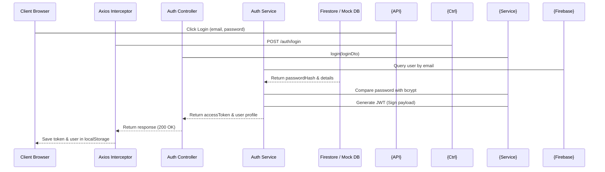
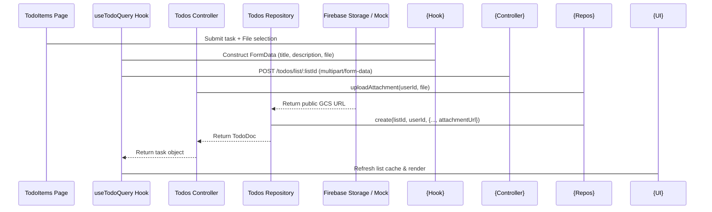

# Project Analysis: SaaS Todo Application

This document provides a comprehensive structural and architectural analysis of the **SaaS Todo List** project. The project is split into a **NestJS Backend** and a **React + Vite Frontend**, featuring integration with **Google Firebase (Firestore & Cloud Storage)** alongside an **in-memory offline fallback mode** for seamless local development.

---

## 1. Project Overview & Tech Stack

### Backend Stack
- **Framework**: [NestJS](http://nestjs.com/) (v11) - Node.js framework with modular structure, decorators, and Dependency Injection.
- **Authentication**: JWT Strategy via `@nestjs/jwt` and `@nestjs/passport`.
- **Database/Storage**: [Google Cloud Firestore](https://firebase.google.com/docs/firestore) and [Google Cloud Storage (GCS)](https://cloud.google.com/storage) via `firebase-admin`.
- **Validation**: `class-validator` and `class-transformer` for DTO-level input validation.
- **Documentation**: [Swagger API Client](https://swagger.io/) at `/api/docs`.

### Frontend Stack
- **Framework**: [React](https://react.dev/) (v19) bundled with [Vite](https://vite.dev/) (v8) for fast compilation and HMR.
- **State & Data Fetching**: [@tanstack/react-query](https://tanstack.com/query/latest) (v5) for asynchronous query/mutation caching, prefetching, and state invalidation.
- **Styling**: [Tailwind CSS](https://tailwindcss.com/) (v3) with a premium custom dark mode, gradient highlights, and glassmorphism.
- **Icons**: [Lucide React](https://lucide.dev/) for vector icons.
- **API Client**: [Axios](https://axios-http.com/) configured with request/response interceptors.

---

## 2. Directory Structure & Key Files

The project contains two main workspaces: [backend](file:///d:/personal/todo-saas/backend) and [frontend](file:///d:/personal/todo-saas/frontend).

### Backend Layout
- [package.json](file:///d:/personal/todo-saas/backend/package.json): Holds NPM scripts, Nest dependencies, and testing tools (Jest).
- [src/main.ts](file:///d:/personal/todo-saas/backend/src/main.ts): The application entry point. Enables global validation, configures CORS, and compiles Swagger documentation.
- [src/app.module.ts](file:///d:/personal/todo-saas/backend/src/app.module.ts): The root application module importing all sub-modules.
- **Firebase Module**:
  - [firebase.service.ts](file:///d:/personal/todo-saas/backend/src/firebase/firebase.service.ts): Reads env credentials. If offline or dummy credentials are set, it boots in offline mock mode.
- **Auth Module**:
  - [auth.controller.ts](file:///d:/personal/todo-saas/backend/src/auth/auth.controller.ts): Routes for registration, login, and fetching user profiles.
  - [auth.service.ts](file:///d:/personal/todo-saas/backend/src/auth/auth.service.ts): Handles password hashing via `bcrypt`, token signing, and database synchronization.
  - [jwt.strategy.ts](file:///d:/personal/todo-saas/backend/src/auth/strategies/jwt.strategy.ts): Extracting and validating JWT payload (`sub`, `email`).
  - [get-user.decorator.ts](file:///d:/personal/todo-saas/backend/src/auth/decorators/get-user.decorator.ts): Custom parameter decorator to extract verified user details from request payloads.
- **TodoLists Module**:
  - [todo-lists.controller.ts](file:///d:/personal/todo-saas/backend/src/todo-lists/todo-lists.controller.ts): CRUD routes for Todo lists, protected by JWT authentication.
  - [todo-lists.service.ts](file:///d:/personal/todo-saas/backend/src/todo-lists/todo-lists.service.ts): Business logic ensuring list resource ownership.
  - [todo-lists.repository.ts](file:///d:/personal/todo-saas/backend/src/todo-lists/todo-lists.repository.ts): Persistence class executing Firestore operations or simulating via memory map storage (`mockStore`).
- **Todos Module**:
  - [todos.controller.ts](file:///d:/personal/todo-saas/backend/src/todos/todos.controller.ts): CRUD routes for items, handling file uploads with NestJS `FileInterceptor`.
  - [todos.service.ts](file:///d:/personal/todo-saas/backend/src/todos/todos.service.ts): Verifies list access and interacts with repository.
  - [todos.repository.ts](file:///d:/personal/todo-saas/backend/src/todos/todos.repository.ts): Performs task CRUD and handles GCS uploads or falling back to local files.

### Frontend Layout
- [package.json](file:///d:/personal/todo-saas/frontend/package.json): Frontend dependencies, React Query, Vite, and tailwind.
- [src/main.tsx](file:///d:/personal/todo-saas/frontend/src/main.tsx): Mounts the React application tree.
- [src/App.tsx](file:///d:/personal/todo-saas/frontend/src/App.tsx): Initiates routing, sets up the `QueryClientProvider`, and handles layout wrapper routes.
- [src/services/api.ts](file:///d:/personal/todo-saas/frontend/src/services/api.ts): Custom Axios client with interceptors for JWT bearer token appending and auto-logout on `401 Unauthorized` responses.
- [src/context/AuthContext.tsx](file:///d:/personal/todo-saas/frontend/src/context/AuthContext.tsx): Manages user profile validation, session recovery from `localStorage`, and login state.
- **Custom Hooks**:
  - [useAuthQuery.ts](file:///d:/personal/todo-saas/frontend/src/hooks/useAuthQuery.ts): Mutations wrapping API requests for signup and signin.
  - [useListQuery.ts](file:///d:/personal/todo-saas/frontend/src/hooks/useListQuery.ts): CRUD queries/mutations for list boards.
  - [useTodoQuery.ts](file:///d:/personal/todo-saas/frontend/src/hooks/useTodoQuery.ts): CRUD operations for individual task items, converting payload formats into `FormData` for multipart attachments.
- **Pages**:
  - [Dashboard.tsx](file:///d:/personal/todo-saas/frontend/src/pages/Dashboard.tsx): Modern grid layout showing analytical stats, active database flags, and quick list previews.
  - [TodoLists.tsx](file:///d:/personal/todo-saas/frontend/src/pages/TodoLists.tsx): Board interface supporting CRUD through overlay modals.
  - [TodoItems.tsx](file:///d:/personal/todo-saas/frontend/src/pages/TodoItems.tsx): Inside-list detailed panel displaying task lists, toggling completion status, and uploading files.

---

## 3. Core Architectural Patterns

### 1. Hybrid Offline/Online Persistence Mode
A powerful pattern in this codebase is the transparent fallback to in-memory repositories.
- If Firebase environment configurations are missing, [FirebaseService](file:///d:/personal/todo-saas/backend/src/firebase/firebase.service.ts) logs:
  > Running in OFFLINE MOCK MODE with local repositories.
- Repositories like [TodoListsRepository](file:///d:/personal/todo-saas/backend/src/todo-lists/todo-lists.repository.ts) fallback to a local `Map<string, TodoListDoc[]>` rather than throwing errors. This allows developing frontend styles and running tests without cloud service dependencies.

### 2. Guard & Ownership Checking
Security in the application is hierarchical:
1. **Route Security**: Handled globally at controller endpoints via `UseGuards(JwtAuthGuard)`.
2. **Access Control**: Validated inside Nest services by confirming user IDs match database records before updating or deleting:
   ```typescript
   // todo-lists.service.ts
   if (list.userId !== userId) {
     throw new ForbiddenException('You do not have permission to access this todo list');
   }
   ```

### 3. Automatic Cascading Deletion
To prevent orphan database files, deleting a todo list triggers a cascading delete pattern.
- In [TodoListsRepository](file:///d:/personal/todo-saas/backend/src/todo-lists/todo-lists.repository.ts#L118-L130), a Firestore transaction batch gathers and deletes all todos referencing that list.
- In [TodosRepository](file:///d:/personal/todo-saas/backend/src/todos/todos.repository.ts#L132-L148), deleting a single todo item extracts the asset path and invokes GCS to clean up the attachment.

### 4. Query-Driven UI Cache Management
Using React Query, mutations invalidate queries automatically:
- When a new todo is created via `createTodoMutation` in [useTodoQuery.ts](file:///d:/personal/todo-saas/frontend/src/hooks/useTodoQuery.ts), it calls `queryClient.invalidateQueries` for that specific list.
- This results in a highly dynamic UI, refreshing lists and analytical graphs immediately without full page reloads.

---

## 4. Logical System Flows

### User Sign-in & Authentication Flow


### Creating Tasks with File Attachments

